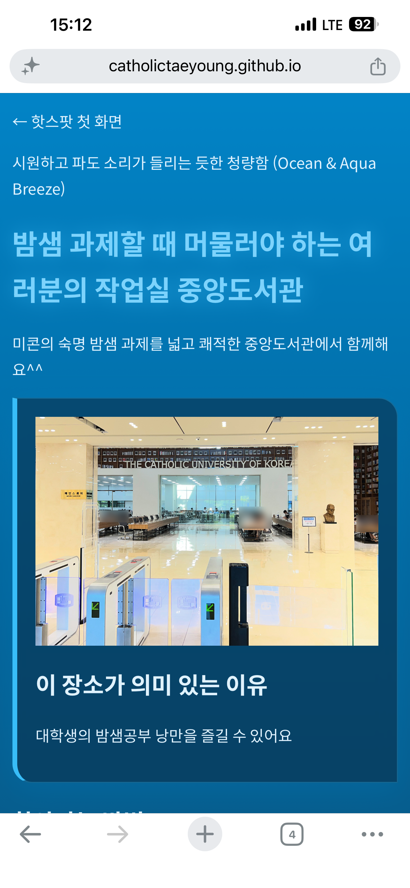

# 나만의 캠퍼스 핫스팟
이름은 **박태영**, 공개 주소는 `https://catholictaeyoung.github.io/campus-hotspots/` 입니다.

## 2주차 실습 과제 · 나만의 캠퍼스 핫스팟
학교 안에서 다른 학생에게 소개하고 싶은 장소 3곳을 골라 만든 작은 홈페이지입니다.

### ✨ 주요 기능
- 장소 추천: 교내에서 가장 아끼고 공유하고 싶은 핫스팟 3곳 소개
- 웹페이지 구현: HTML을 활용한 미니 홈페이지 제작

### 🛠 Tech Stack
- HTML


## 3주차: 네 페이지, 네 가지 분위기

| 장소 | 분위기 | 사용한 class |
| --- | --- | --- |
| D411 | 석양빛 언덕과 따스한 시야 (Warm Sunset & Soft Round) | `page-d411` |
| B333 | 픽셀 아트 스타일의 레트로 (8-Bit Arcade & Retro) | `page-b333` |
| 중앙도서관 | 시원하고 파도 소리가 들리는 듯한 청량함 (Ocean & Aqua Breeze) | `page-library` |

### 적용한 CSS

```css
.page-library {
  background-color: #f6f1e7;
  font-family: "Noto Serif KR", serif;
}
```

어두운 배경에서도 링크가 보이도록 `currentColor` 를 사용했습니다.



- [x] 네 페이지에 styles.css를 연결했다
- [ ] 휴대전화에서 확인했다