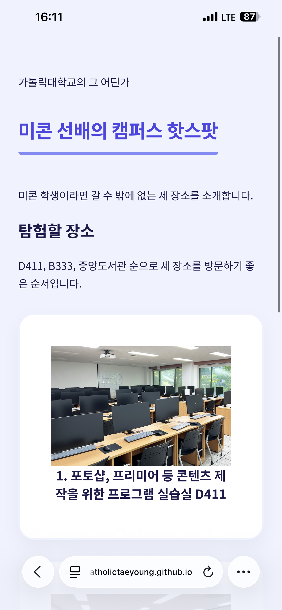
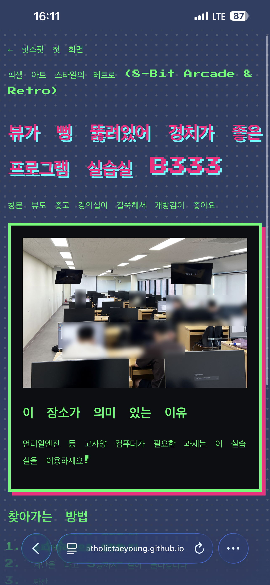
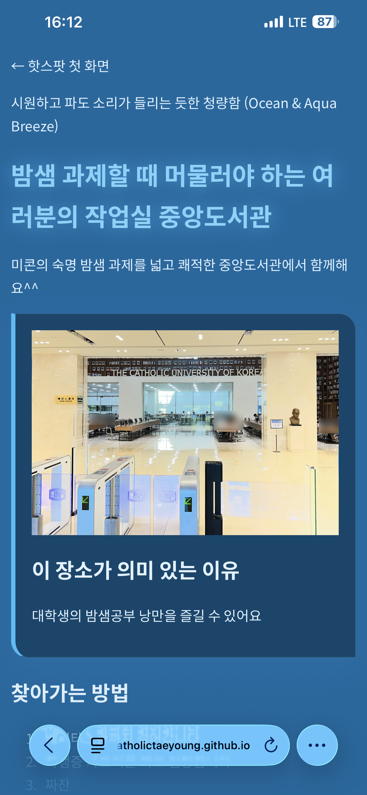
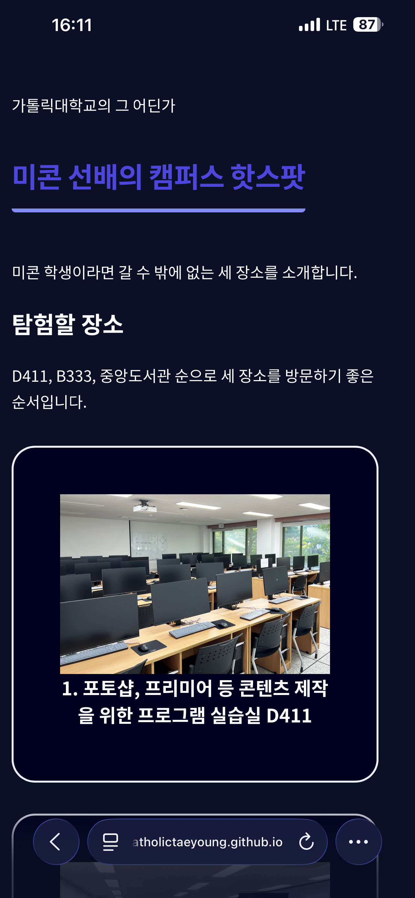
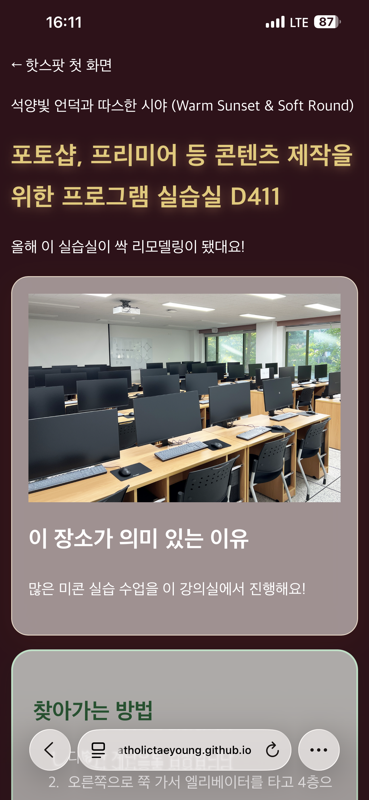
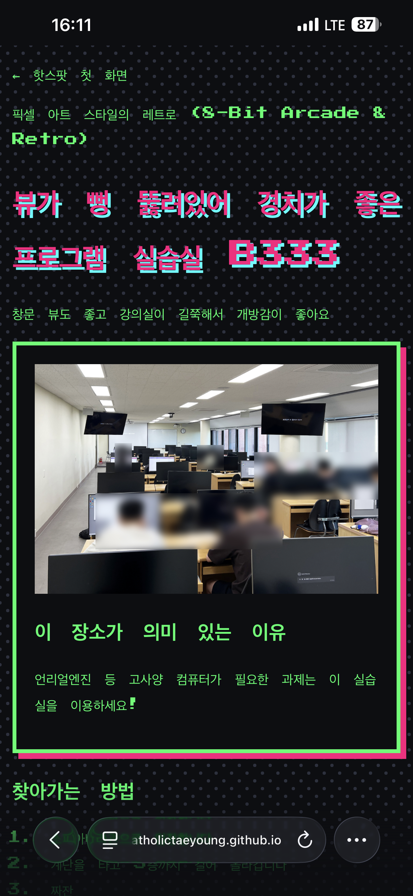
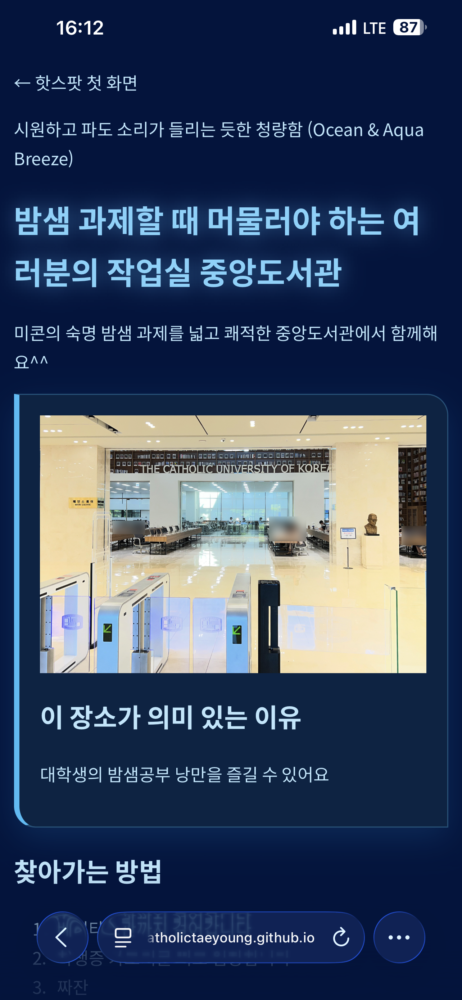

# 나만의 캠퍼스 핫스팟
이름은 **박태영**, 공개 주소는 `https://catholictaeyoung.github.io/campus-hotspots/` 입니다.  

## 2주차 실습 과제 · 나만의 캠퍼스 핫스팟
학교 안에서 다른 학생에게 소개하고 싶은 장소 3곳을 골라 만든 작은 홈페이지입니다.

### ✨ 주요 기능
- 장소 추천: 교내에서 가장 아끼고 공유하고 싶은 핫스팟 3곳 소개
- 웹페이지 구현: HTML을 활용한 미니 홈페이지 제작

### 🛠 Tech Stack
- HTML  

## 3주차 실습 과제 · 네 페이지, 네 가지 분위기

- GitHub Pages URL: https://catholictaeyoung.github.io/campus-hotspots/

### 페이지별 스타일
| 페이지 | 의도한 분위기 | 적용한 class | 적용한 CSS |
| --- | --- | --- | --- |
| 프론트페이지 | 통통 튀고 생동감 넘치는 트렌디 대도시 (Vibrant & Playful Urban) | `page-d411` | `background-color: #f0f3ff;`, `transition: all 0.25s cubic-bezier(0.34, 1.56, 0.64, 1);`, `transform: translateY(-4px) scale(1.03);` |
| D411 | 석양빛 언덕과 따스한 시야 (Warm Sunset & Soft Round) | `page-d411`, `how_to_get_there`, `what_should_we_do` | `transform: translateY(-3px);` |
| B333 | 픽셀 아트 스타일의 레트로 (8-Bit Arcade & Retro) | `page-b333`, `how_to_get_there`, `what_should_we_do` | `background-image: radial-gradient(#515c72 15%, transparent 16%), radial-gradient(#374259 15%, transparent 16%);` |
| 중앙도서관 | 시원하고 파도 소리가 들리는 듯한 청량함 (Ocean & Aqua Breeze) | `page-library`, `how_to_get_there`, `what_should_we_do` | `transform: translateY(-3px) scale(1.02);` |

### 모바일 스타일
- 적용한 @media 조건: `@media (max-width: 600px) and (prefers-color-scheme: dark)`
- 모바일에서 특별히 바뀌는 부분과 이유: 휴대전화에서 다크모드를 적용하면 어두운 화면에 어울리는 색으로 배경색과 폰트색이 바뀐다!
- 휴대전화에서 네 페이지를 확인한 결과:

| 구분 | 메인페이지 | D411 | B333 | 중앙도서관 |
| --- | --- | --- | --- | --- |
| 라이트모드 |  |  |  |  |
| 다크모드 |  |  |  |  |

### 출처
- 새로 사용한 이미지·웹폰트의 출처(사용한 경우):

| 서체명 (Font Name) | 구편 / 출처 분류 | 원본 링크 / 폰트 웹사이트 |
| :--- | :--- | :--- |
| **Noto Sans KR** | Google Fonts | [Google Fonts - Noto Sans KR](https://fonts.google.com/specimen/Noto+Sans+KR) |
| **Noto Serif KR** | Google Fonts | [Google Fonts - Noto Serif KR](https://fonts.google.com/specimen/Noto+Serif+KR) |
| **Press Start 2P** | Google Fonts | [Google Fonts - Press Start 2P](https://fonts.google.com/specimen/Press+Start+2P) |
| **둥근모꼴** | 눈누 (Noonnu CDN) | [눈누 - 둥근모꼴](https://noonnu.cc/font_page/28) |

## 4주차: JavaScript 실습

- 장소 탐험 페이지: https://catholictaeyoung.github.io/campus-hotspots/week4/
- 통계 페이지: https://catholictaeyoung.github.io/campus-hotspots/week4/statistics.html
- 게임 페이지: https://catholictaeyoung.github.io/campus-hotspots/week4/game.html

### 실습 1
- 내가 수정한 부분: 상단에 통계페이지, 게임 페이지로 이동하는 버튼을 추가했고, D411, B333, 중앙도서관 버튼과 그에 맞는 내용으로 수정했다. 지도도 링크를 타고 들어가는 것이 아니라 iframe으로 바로 위치를 확인할 수 있도록 수정했다.
- 버튼 클릭 → 내용 변경 → 지도 변경의 흐름:
- 휴대전화에서 확인한 결과:

### 실습 2
- 데이터 출처 URL / 내려받은 날짜: [한국교통안전공단 전국 전기차 차종별 용도별 차량 등록대수(운행차량기준)](https://www.data.go.kr/data/15142951/fileData.do), [무공해차 통합누리집 - 우리 지역 급속 충전 여건](https://ev.or.kr/nportal/stats/statsDashboard.do#chargeInfraStatus) / 2026-09-23
- 데이터 선택 이유 / 대상·기간·단위: 전기차의 인기는 매우 높지만, 전기차 대수에 비해 충전기가 많이 부족한 것 같다. / 대한민국 전 지역, ~ 2026-09-20, 대수
- 그래프 1: 질문: 지역별 전기차 등록대수는 얼마나 다른가? / 사용한 열: 전기차 등록대수 CSV의 `시군구별`, `연료별`, `계` / 그래프 형식과 선택 이유: 지역별 전기차 대수를 비교하기 위해 막대그래프를 사용했다. 막대의 높이를 비교하면 지역별 등록대수 차이를 쉽게 확인할 수 있기 때문이다. / 해석: 광주, 울산, 서울, 대구, 대전, 전북, 경북, 인천, 전남의 전기차 등록대수를 비교해 지역별 전기차 분포를 확인할 수 있다.
- 그래프 2: 질문: 지역별 완속충전기 수와 전기차 대비 완속충전기 보급률은 어떻게 다른가? / 사용한 열: 충전기 CSV의 `지역`, `완속 (30kW 미만)`, `중속 (30~49kW)`, 전기차 CSV의 `시군구별`, `연료별`, `계` / 그래프 형식과 선택 이유: 완속충전기 대수는 막대그래프, 보급률은 line 그래프로 표시한 혼합 그래프를 사용했다. 충전기 규모와 비율을 동시에 비교하기 위해 서로 다른 축을 사용했다. / 해석: 완속충전기는 전체 충전기 수를 늘리는 데 기여하지만, 충전 시간이 길어 실제 이용자가 느끼는 대기시간과 단순 보급률 사이에는 차이가 있을 수 있다.
- 그래프 3: 질문: 지역별 고속충전기 수와 전기차 대비 고속충전기 보급률은 어떻게 다른가? / 사용한 열: 충전기 CSV의 `지역`, `급속 (50~99kW)`, `급속 (100~199kW)`, `초급속 (200kW 이상)`, 전기차 CSV의 `시군구별`, `연료별`, `계` / 그래프 형식과 선택 이유: 고속충전기 대수는 막대그래프, 보급률은 line 그래프로 표시한 혼합 그래프를 사용했다. 지역별 충전 인프라 규모와 전기차 대비 공급 수준을 한눈에 비교하기 위해 선택했다. / 해석: 고속충전기는 이동 중 빠른 충전에 필요하지만 완속충전기보다 수가 적어, 전기차가 많은 지역에서는 고속충전기 1대가 담당하는 차량 수가 많을 수 있다.
- 그래프 4: 질문: 지역별 완속충전기와 고속충전기의 구성 및 전체 충전기 보급률은 어떻게 다른가? / 사용한 열: 충전기 CSV의 `지역`, `완속 (30kW 미만)`, `중속 (30~49kW)`, `급속 (50~99kW)`, `급속 (100~199kW)`, `초급속 (200kW 이상)`, `합계`, 전기차 CSV의 `시군구별`, `연료별`, `계` / 그래프 형식과 선택 이유: 완속충전기와 고속충전기를 각각 막대그래프로, 전체 충전기 보급률을 line 그래프로 표시했다. 충전기 종류별 수량과 전체적인 전기차 대비 보급 수준을 동시에 비교하기 위해 선택했다. / 해석: 전체 충전기 수만 보면 보급률이 높아 보일 수 있지만, 지역별 충전기 구성과 전기차 등록대수를 함께 확인해야 실제 충전 편의성과 지역 격차를 판단할 수 있다.
- 필터링·집계·결측치 처리: 전기차 데이터는 `연료별` 값이 `전기`인 행만 필터링하고, `시군구별`의 광역 지역명과 `계` 열을 이용해 지역별 전기차 대수를 합산했다. 충전기 데이터는 `지역`을 기준으로 `완속 (30kW 미만)`과 `중속 (30~49kW)`을 더해 완속충전기 대수를 계산하고, `급속 (50~99kW)`, `급속 (100~199kW)`, `초급속 (200kW 이상)`을 더해 고속충전기 대수를 계산했으며, `합계` 열은 모든 충전기 대수로 사용했다. 두 파일의 `서울특별시/서울`, `경기도/경기`처럼 다른 지역명은 같은 표준명으로 정규화했다. 쉼표가 포함된 숫자는 쉼표를 제거한 뒤 숫자로 변환했고, 비어 있거나 숫자로 변환되지 않는 값은 0으로 처리했다.
- 네 탭 전환 방식: 버튼 클릭
- 휴대전화에서 네 탭을 확인한 결과: 잘 작동함
- 빈 데이터·잘못된 CSV를 넣었을 때 결과:
- Copilot 활용: 도움받은 작업 / 대표 질문 / 직접 수정·검증한 내용: 충전기 모든 대수 합산, 지역 별로 구분, 충전기 보급율 표시, 차트 그리기

### 실습 3
- 게임 이름 / 아이디어 / 조작과 규칙: 벽돌 깨기 / 벽돌 깨기 게임이다 / 땅에 떨어지지 않고 제한된 시간 안에 모든 벽돌을 부수면 승리한다.
- Copilot에게 보낸 첫 질문: `html canvas 기능을 이용해서, game.html과 game.js에 벽돌깨기 게임을 만들어줘. 3분 안에 10줄 부수면 game clear, 못부수면 game over 뜨게. 게임 상단 왼쪽에 점수, 오른쪽에 타이머 만들어줘.`
- 추가 수정 요청과 개선한 점: 3, 2, 1, 시작 문구가 나오도록, 그리고 '게임 시작 버튼'을 누르면 게임 플레이하는 동안 '게임 다시 시작' 버튼이 나오지 않도록 수정 요청했다.
- 직접 확인한 동작: 조작 / 점수 / 종료 / 재시작: 조작 / 점수 / 종료 / 재시작 모두 확인했다.
- 휴대전화에서 확인한 결과: 휴대전화에서는 드래그를 해서 패들을 움직일 수 있다.
- 이미지·소리 출처와 이용 조건(사용한 경우): 없음