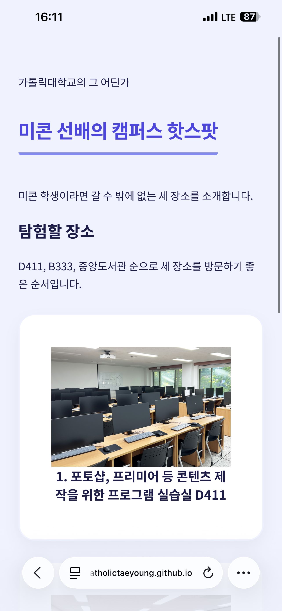
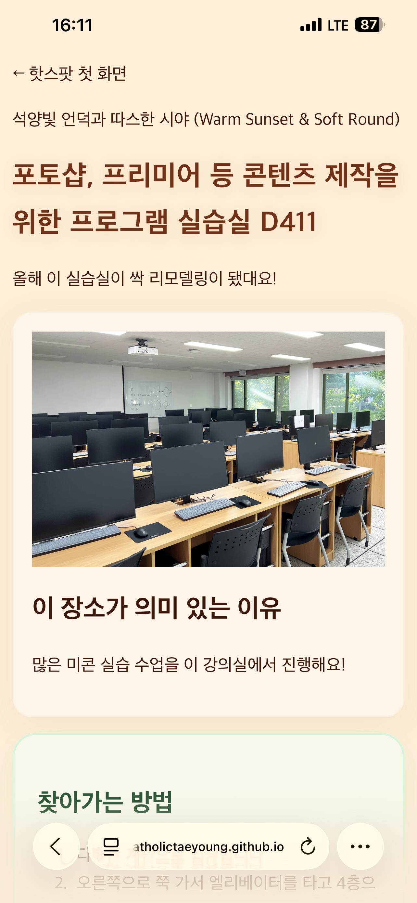
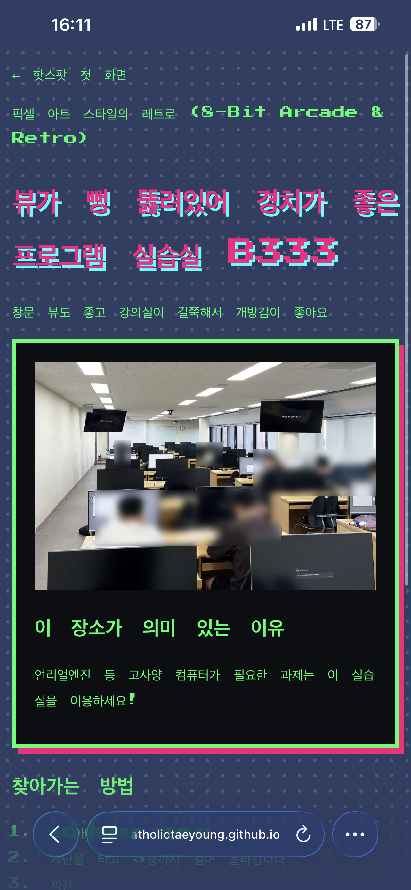
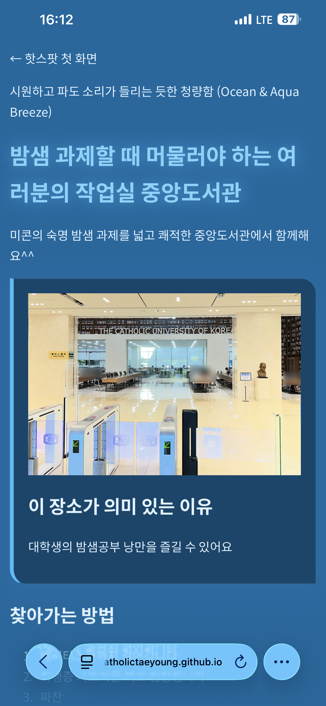
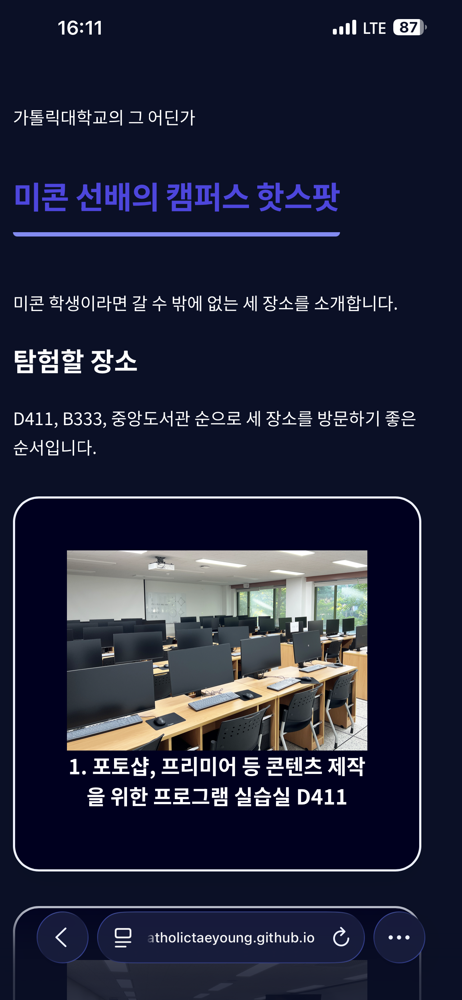
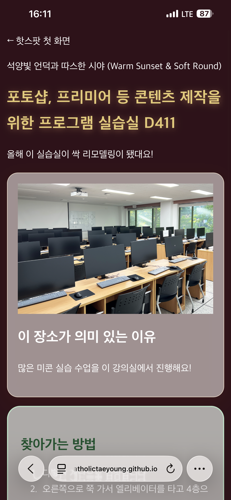
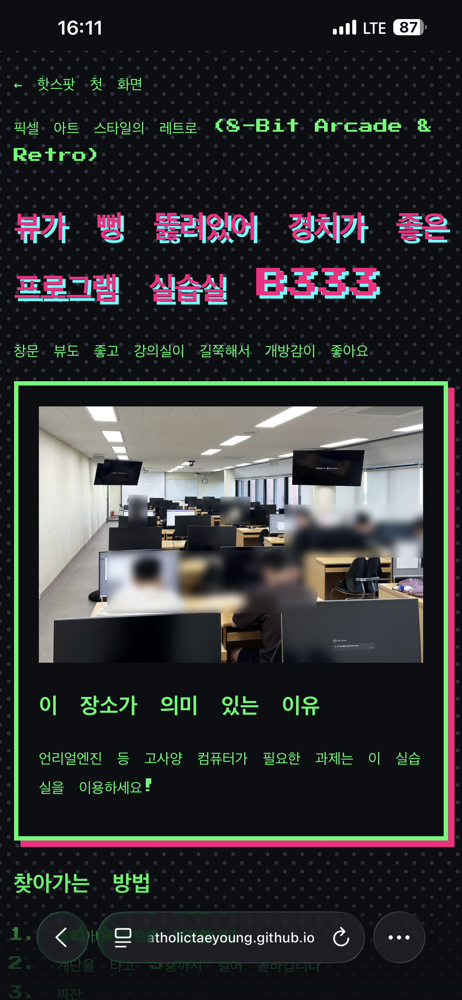
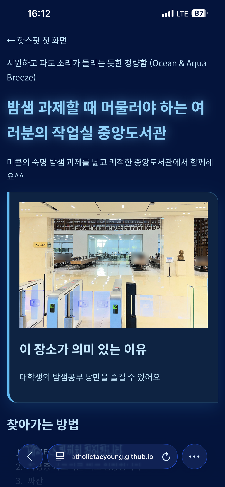

# 나만의 캠퍼스 핫스팟
이름은 **박태영**, 공개 주소는 `https://catholictaeyoung.github.io/campus-hotspots/` 입니다.  

## 2주차 실습 과제 · 나만의 캠퍼스 핫스팟
학교 안에서 다른 학생에게 소개하고 싶은 장소 3곳을 골라 만든 작은 홈페이지입니다.

### ✨ 주요 기능
- 장소 추천: 교내에서 가장 아끼고 공유하고 싶은 핫스팟 3곳 소개
- 웹페이지 구현: HTML을 활용한 미니 홈페이지 제작

### 🛠 Tech Stack
- HTML  

## 3주차 실습 과제 · 네 페이지, 네 가지 분위기

- GitHub Pages URL: https://catholictaeyoung.github.io/campus-hotspots/

### 페이지별 스타일
| 페이지 | 의도한 분위기 | 적용한 class | 적용한 CSS |
| --- | --- | --- | --- |
| 프론트페이지 | 통통 튀고 생동감 넘치는 트렌디 대도시 (Vibrant & Playful Urban) | `page-d411` | `background-color: #f0f3ff;`, `transition: all 0.25s cubic-bezier(0.34, 1.56, 0.64, 1);`, `transform: translateY(-4px) scale(1.03);` |
| D411 | 석양빛 언덕과 따스한 시야 (Warm Sunset & Soft Round) | `page-d411`, `how_to_get_there`, `what_should_we_do` | `transform: translateY(-3px);` |
| B333 | 픽셀 아트 스타일의 레트로 (8-Bit Arcade & Retro) | `page-b333`, `how_to_get_there`, `what_should_we_do` | `background-image: radial-gradient(#515c72 15%, transparent 16%), radial-gradient(#374259 15%, transparent 16%);` |
| 중앙도서관 | 시원하고 파도 소리가 들리는 듯한 청량함 (Ocean & Aqua Breeze) | `page-library`, `how_to_get_there`, `what_should_we_do` | `transform: translateY(-3px) scale(1.02);` |

### 모바일 스타일
- 적용한 @media 조건: `@media (max-width: 600px) and (prefers-color-scheme: dark)`
- 모바일에서 특별히 바뀌는 부분과 이유: 휴대전화에서 다크모드를 적용하면 어두운 화면에 어울리는 색으로 배경색과 폰트색이 바뀐다!
- 휴대전화에서 네 페이지를 확인한 결과:

| 구분 | 메인페이지 | D411 | B333 | 중앙도서관 |
| --- | --- | --- | --- | --- |
| 라이트모드 |  |  |  |  |
| 다크모드 |  |  |  |  |

### 출처
- 새로 사용한 이미지·웹폰트의 출처(사용한 경우):

| 서체명 (Font Name) | 구편 / 출처 분류 | 원본 링크 / 폰트 웹사이트 |
| :--- | :--- | :--- |
| **Noto Sans KR** | Google Fonts | [Google Fonts - Noto Sans KR](https://fonts.google.com/specimen/Noto+Sans+KR) |
| **Noto Serif KR** | Google Fonts | [Google Fonts - Noto Serif KR](https://fonts.google.com/specimen/Noto+Serif+KR) |
| **Press Start 2P** | Google Fonts | [Google Fonts - Press Start 2P](https://fonts.google.com/specimen/Press+Start+2P) |
| **둥근모꼴** | 눈누 (Noonnu CDN) | [눈누 - 둥근모꼴](https://noonnu.cc/font_page/28) |

## 4주차: JavaScript 실습

- 장소 탐험 페이지: https://catholictaeyoung.github.io/campus-hotspots/week4/
- 통계 페이지: https://catholictaeyoung.github.io/campus-hotspots/week4/statistics.html
- 게임 페이지: https://catholictaeyoung.github.io/campus-hotspots/week4/game.html

### 실습 1
- 내가 수정한 부분: 상단에 통계페이지, 게임 페이지로 이동하는 버튼을 추가했고, D411, B333, 중앙도서관 버튼과 그에 맞는 내용으로 수정했다. 지도도 링크를 타고 들어가는 것이 아니라 iframe으로 바로 위치를 확인할 수 있도록 수정했다.
- 버튼 클릭 → 내용 변경 → 지도 변경의 흐름: 잘 작동함
- 휴대전화에서 확인한 결과: 잘 작동함

### 실습 2
- 데이터 출처 URL / 내려받은 날짜: [한국교통안전공단 전국 전기차 차종별 용도별 차량 등록대수(운행차량기준)](https://www.data.go.kr/data/15142951/fileData.do), [무공해차 통합누리집 - 우리 지역 급속 충전 여건](https://ev.or.kr/nportal/stats/statsDashboard.do#chargeInfraStatus) / 2026-09-23
- 데이터 선택 이유 / 대상·기간·단위: 전기차의 인기는 매우 높지만, 전기차 대수에 비해 충전기가 많이 부족한 것 같다. / 대한민국 전 지역, ~ 2026-09-20, 대수
- 그래프 1: 질문: 지역별 전기차 등록대수는 얼마나 다른가? / 사용한 열: 시군구별, 연료별, 계 / 형식·이유: 지역별 차이를 비교하기 쉬운 막대그래프 / 해석: 경기·서울·인천 등 지역별 전기차 분포를 확인했다.
- 그래프 2: 질문: 지역별 완속충전기 수와 보급률은 어떤가? / 사용한 열: 지역, 완속(30kW 미만), 중속(30~49kW), 전기차 / 형식·이유: 완속충전기는 막대, 보급률은 line으로 표시해 수량과 비율을 함께 비교 / 해석: 완속충전기가 많아도 충전 시간이 길어 실제 체감 편의성과 차이가 있을 수 있다.
- 그래프 3: 질문: 지역별 고속충전기 수와 보급률은 어떤가? / 사용한 열: 지역, 급속(50~99kW), 급속(100~199kW), 초급속(200kW 이상), 전기차 / 형식·이유: 고속충전기 막대와 보급률 line을 함께 표시 / 해석: 고속충전기가 적은 지역은 충전기 1대가 담당하는 차량 수가 많을 수 있다.
- 그래프 4: 질문: 지역별 완속·고속충전기 구성과 전체 보급률은 어떤가? / 사용한 열: 충전기 종류별 열과 합계, 전기차 / 형식·이유: 완속·고속충전기 막대와 전체 보급률 line을 함께 비교 / 해석: 전체 수량뿐 아니라 충전기 구성과 지역별 전기차 수를 함께 봐야 충전 편의성을 판단할 수 있다.
- 필터링·집계·결측치 처리: 전기차는 연료별=전기만 지역별로 합산했다. 완속·고속충전기는 해당 열을 지역별로 합산하고, 전체는 합계를 사용했다. 지역명은 표준명으로 통일했으며 쉼표를 제거해 숫자로 변환하고 빈 값은 0으로 처리했다.
- 네 탭 전환 방식: 버튼 클릭
- 휴대전화에서 네 탭을 확인한 결과: 잘 작동함
- 빈 데이터·잘못된 CSV를 넣었을 때 결과: 빈 CSV는 데이터가 없어 집계 단계에서 오류 처리되며 `CSV를 불러오지 못했습니다. 웹 서버로 파일을 실행했는지 확인하세요.`가 표시됨. 필수 열이 없는 잘못된 CSV는 파싱은 되지만 지역과 수치 데이터를 찾지 못해 그래프가 빈 상태로 표시됨.
- Copilot 활용: 도움받은 작업 / 대표 질문 / 직접 수정·검증한 내용: 충전기 모든 대수 합산, 지역 별로 구분, 충전기 보급율 표시, 차트 그리기

### 실습 3
- 게임 이름 / 아이디어 / 조작과 규칙: 벽돌 깨기 / 벽돌 깨기 게임이다 / 땅에 떨어지지 않고 제한된 시간 안에 모든 벽돌을 부수면 승리한다.
- Copilot에게 보낸 첫 질문: `html canvas 기능을 이용해서, game.html과 game.js에 벽돌깨기 게임을 만들어줘. 3분 안에 10줄 부수면 game clear, 못부수면 game over 뜨게. 게임 상단 왼쪽에 점수, 오른쪽에 타이머 만들어줘.`
- 추가 수정 요청과 개선한 점: 3, 2, 1, 시작 문구가 나오도록, 그리고 '게임 시작 버튼'을 누르면 게임 플레이하는 동안 '게임 다시 시작' 버튼이 나오지 않도록 수정 요청했다.
- 직접 확인한 동작: 조작 / 점수 / 종료 / 재시작: 조작 / 점수 / 종료 / 재시작 모두 확인했다.
- 휴대전화에서 확인한 결과: 휴대전화에서는 드래그를 해서 패들을 움직일 수 있다.
- 이미지·소리 출처와 이용 조건(사용한 경우): 없음

## 5주차 · 나만의 취향 밸런스 게임

- 게임 주소: https://catholictaeyoung.github.io/campus-hotspots/week5/
- 게임 이름과 소개: 넌 도움이 되는 친구니? · 팀 프로젝트 성향 밸런스 게임
- 게임의 대상과 주제를 선택한 이유: 팀프로젝트를 할 때 가장 중요한 건 좋은 팀원을 만나는 것이다. 내가 아무리 잘하고 열심히 해도 팀원을 잘못 만나면 그 팀플 과제는 망한다. 많은 대학생들이 이것에 공감할 것이기에 이 주제로 선택했다.
- 기본 예제에 없는 질문 최소 4개: `팀플 첫 모임, 어색한 공기를 깨는 나의 방식은?`, `팀 단톡방 알림이 울렸을 때 나의 반응은?`, `팀 과제 역할을 나눌 때 내가 선호하는 포지션은?`, `마감일까지 과제를 진행하는 나의 스타일은?`
- 직접 만든 결과 이름·설명과 선택의 연결:

| 결과 이름 | 한줄 설명 | 특징 |
|---|---|---|
| 하드캐리 총괄러 (주도적 계획형) | 내 사전에 벼락치기는 없다! 팀을 이끌고 100점을 향해 직진하는 완벽주의 리더 | 전체적인 판을 짜고 주도하는 것을 선호하며, 마감 전 미리미리 과제를 끝내야 직성이 풀리는 스타일입니다. |
| 불꽃 벼락치기러 (즉흥적 해결형) | "마감 직전의 에너지가 곧 나의 힘! 위기 속에서 기적을 만드는 마법사" | 평소엔 여유롭다가 마감 직전에 초인적인 집중력을 발휘해 결과물을 뚝딱 만들어내는 능력자입니다. |
| 묵묵한 하드워커 (실속형 서포터) | "말보다는 행동으로 증명한다! 팀의 든든한 대들보 같은 실속파" | 앞에 나서기보다는 조용히 자기 몫을 완벽하게 해내며, 팀이 흔들릴 때 가장 실질적인 도움을 주는 조력자입니다. |
| 아이디어 뱅크 크리에이터 (창의적 혁신형) | "평범함은 거부한다! 팀플에 신선한 충격을 불어넣는 엉뚱한 기획자" | 남들이 생각하지 못한 참신하고 독창적인 아이디어를 마구 뿜어내며 팀의 방향성을 재미있게 만들어줍니다. |
| 팩트폭격 전략가 (이성적 분석형) | "감정보다는 데이터! 냉철한 분석으로 논리적 오류를 잡아내는 브레인" | 직설적인 피드백도 객관적으로 수용하며, 감정 싸움 없이 오직 효율과 논리로 프로젝트를 승리로 이끕니다. |
| 감성 충만 분위기메이커 (공감형 중재자) | "팀원들의 멘탈을 지켜주는 수호천사! 둥글게 둥글게 평화를 사랑하는 조율사" | 팀원들의 감정을 먼저 헤아리고 배려하며, 의견 충돌이 생겼을 때 부드럽게 타협점을 찾아내는 따뜻한 소통러입니다. |

- 나만의 표현 한 가지와 구현한 위치: '팀프로젝트' 상황에 어울리는 질문을 10가지로, 프로필을 6가지로 만들어서 수정했다.
- 결과 분류 규칙과 동점 처리: 6개의 프로필에 기대하는 선택을 미리 정해둔다. 답변과 프로필의 기준을 비교하고, 일치하면 점수를 1점씩 올린다. 결과적으로 점수가 가장 높은 프로필을 최종 결과로 출력한다. 만약 동점인 경우 `hardcarry → crammer → support → creative → analyst → mediator`의 우선순위로 결과를 출력한다.

| 프로필 | 점수 조건 |
|---|---|
| `hardcarry` | `ice: 0`, `ping: 0`, `role: 0`, `pace: 0`, `prep: 0`, `stage: 0` |
| `crammer` | `ping: 1`, `pace: 1`, `prep: 1`, `ghost: 1`, `idea: 1` |
| `support` | `ice: 1`, `role: 1`, `feedback: 1`, `stage: 1` |
| `creative` | `idea: 1`, `prep: 1`, `ping: 1`, `stage: 1` |
| `analyst` | `idea: 0`, `prep: 0`, `feedback: 0`, `clash: 0`, `pace: 0` |
| `mediator` | `ice: 1`, `ghost: 0`, `feedback: 1`, `clash: 1`, `ping: 1` |

### 저장 설계
- sessionStorage에 저장한 값과 이유: 진행 중인 답변을 저장한다. 참여자 ID, 버전, 별명, 현재 문항 번호, 지금까지 선택한 답변을 저장하여 새로고침해도 같은 탭에서 이어할 수 있도록 했다. 탭을 닫으면 진행 중인 답변이 사라져야 하므로 sessionStorage를 사용했다.
- localStorage에 저장한 값과 이유: 완료한 결과 기록을 배열로 저장한다. 각 기록에는 ID, 버전, 별명, 전체 답변, 결과 유형, 완료 시간이 포함된다. 완료 기록은 탭을 닫거나 브라우저를 다시 열어도 남아야 하므로 localStorage를 사용했다.
- 내 데이터 조회·개별 삭제·전체 삭제 동작: `내 저장 데이터 보기`를 누르면 sessionStorage의 진행 중인 답변과 localStorage의 완료 기록을 화면에 표시한다. `이 기록 삭제`는 해당 ID의 기록만 배열에서 제거한 뒤 localStorage에 다시 저장한다. `게임 데이터 전체 삭제`는 진행 중인 답변과 완료 기록을 모두 삭제하고 화면도 초기화한다.

### 확인 결과
- 브라우저와 실험 조건: Chrome에서 GitHub Pages 주소를 열고 별명을 입력한 뒤, 일부 문항만 답한 경우와 10개 문항을 모두 답한 경우를 각각 확인했다. 개발자 도구의 Application 탭에서 sessionStorage와 localStorage의 저장 내용도 확인했다.
- 새로고침 / 독립적인 새 탭 / 탭 닫기 비교: 진행 중인 답변은 같은 탭에서 새로고침하면 남고, 독립적인 새 탭에서는 이어지지 않는다. 탭을 닫으면 sessionStorage의 진행 답변은 사라진다. 완료 기록은 localStorage에 저장되므로 새 탭이나 브라우저를 다시 열어도 같은 주소라면 남는다.
- 중복 저장 / 잘못된 데이터 / 삭제 후 재방문 확인: 같은 참여의 완료 기록은 ID를 확인하여 중복 저장하지 않는다. 버전, 답변 형식, 완료 시간, 결과 유형이 잘못된 기록은 불러올 때 제외한다. 기록 하나를 삭제하거나 전체 삭제한 뒤 새로고침해도 삭제된 기록이 다시 나타나지 않는다.
- 브라우저 저장값을 신뢰할 수 없는 이유: 사용자가 개발자 도구에서 저장값을 직접 수정하거나 삭제할 수 있고, 저장 공간 부족·개인정보 설정·브라우저 오류로 저장과 읽기가 실패할 수도 있다. 따라서 저장값이 항상 올바르거나 영구적으로 보존된다고 보장할 수 없다.
- 적용한 방어 방법: 버전과 ID를 확인하고, 질문 ID와 선택값이 유효한지 검사하며, 완료 시간과 결과 유형의 형식도 확인한다. 잘못된 JSON이나 형식의 기록은 기본값으로 처리하거나 제외한다. 저장소 접근에는 `try...catch`를 사용하고, 저장에 실패하면 현재 실행 중에만 임시 메모리를 사용하며 사용자에게 안내한다. 사용자 입력과 기록은 `textContent`로 출력하여 HTML이 실행되지 않게 했다.

### AI 활용 (사용했다면)
- 도움받은 작업: 팀프로젝트 스타일로 밸런스게임 질문과 답변 만들기, 최종 프로필 점수 계산법 구현하기.
- 대표 질문 한 개: `10가지 질문의 선택지를 눌렀을 때, 적절하게 잘 조합해서 6가지의 결과 중 1개로 나오게 질문과 선택지를 잘 분석해서 로직을 짜줘.`
- 직접 수정·검증한 내용: 점수 로직이 제대로 작동하는지, 동점일 경우 어떻게 되는지 검증했다.